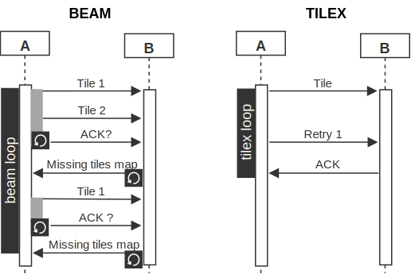




# brays

> v0.9.0


Brays connects client processes with reliable UDP sockets.
The virtual link is exclusive for two clients and all datagrams
received from other parties are discarded. 

Brays is designed with the following assumptions:

1. the processes are hosted close to each other  
2. the environment is trusted

Consequently no (or minimal) frame loss is expected and no congestion regulation is needed.
The clients are expected to operate within a trusted environment thus no security features
are built in.

It's important to be clarified that **brays does not define services** as services 
have boundaries, explicit contracts and are not volatile. Brays is intended to be part of
a subsystem or a component, which is known only to a specific remote party and its
resources (API) are defined at runtime. In a sense, brays connects one system 
which spans multiple hosts. 


### Parts

These are the main parts in brays:

+ **Beamer** - a connected and bound socket; sends and receives frames
+ **XPU** - an exchange processing unit; provides a request-reply API
+ **Lanes** - brays uses [MemoryLanes](https://github.com/arsuq/MemoryLanes) as a data storage

The Beamer implements the splitting and the reliable transmission of the data so that one 
could create custom protocols on top of it. The XPU, for example, defines a basic request-reply
protocol.

Memory lanes are used for assembling the messages in both directions. One could configure 
a memory mapped file storage, the native or the managed heap. Additionally, by implementing the
```IHeapHighway``` interface and producing HeapSlots one could use custom memory management, 
such as box-juggling.


### Communication


The smallest data packet in brays is a tile. By default this is a 40K datagram.
All transmits are divided into tiles so the remote party can request a rebeam of
specific tiles by providing a tile map. 



The reliability knobs are the number of retries and await intervals between the
retries. In general, losing datagrams means that there is either a networking problem,
small buffers on the receiver's side or the processing is slow.


## Beamer

The Beamer's API is very simple:

```csharp
public class Beamer : IDisposable
{
    public Beamer(Action<MemoryFragment> onReceive, BeamerCfg cfg){}
    public Beamer(Func<MemoryFragment, Task> onReceiveAsync, BeamerCfg cfg){}

    public async Task<bool> LockOn(IPEndPoint listen, IPEndPoint target, int awaitMS){}
    public async Task<bool> Beam(MemoryFragment f, int timeoutMS = -1){}
    public ResetEvent Pulse(Span<byte> data){}
    public void TileXFF(Span<byte> data, Action<MemoryFragment> onTileXAwait){}
    public bool Probe(int awaitMS = 2000){}
    public Task<bool> TargetIsActive(int awaitMS = -1){}

    // More 
}
```

Constructing the objects only wires the configurations. One has to ```LockOn()``` in order to create 
and connect the socket. After that the ```Beam()``` is ready to send data.
On the receiving side, the onReceive/onReceiveAsync callback will be invoked after the whole
message is collected, if bigger than a tile.

**Probing**

By default the probing loop is turned off. If enabled it will send a PROBE signal repeatedly
with a specified frequency. Calling ```Probe()``` explicitly sends a probe request and awaits for the
first PROBE signal that is received. The ```TargetIsActive()``` method relies on that to determine whether
the target beamer is operational.

**Pulsing**

Sometimes one needs to pack multiple small data fragments in order to transmit more efficiently.
Calling ```Pulse()``` concurrently or in a loop will buffer the datagram until either:

 + the configuration retention time expires
 + the collected bytes fill a tile

**Fire and forget**

TileXFF() is the only method that doesn't involve retry logic. It works with messages that can fit
in one tile. Although there is a callback and the remote side will respond, it's not a reliable
communication.

**Fragments lifetime**

The received memory fragments must be disposed by the consumer. In case of a unhandled exception in 
the onReceive/Async callbacks, the Beamer will dispose the fragment.

### Configuration

| Setting                    | Default     | Description                                                                          |
| -------------------------- | ----------- | ------------------------------------------------------------------------------------ |
| EnablePulsing              | false       | Pulsing reserves one thread for arranging packets into dgrams                        |
| PulseRetentionMS           | 20          | The max pulse delay in milliseconds                                                  |
| ConfigExchangeTimeout      | 40sec       | The amount of time to wait for the remote config to arrive                           |
| ReceiveBufferSize          | > 25meg     | The default value is ushort.MaxValue * 400                                           |
| SendBufferSize             | > 13meg     | The default value is ushort.MaxValue * 200                                           |
| MaxBeamedTilesAtOnce       | 100         | Prevents dgram losses and re-beams                                                   |
| MaxConcurrentReceives      | 4           | The concurrent socket awaiters count                                                 |
| EnableProbes               | false       | Sends probe dgrams every ProbeFreqMS                                                 |
| ProbeFreqMS                | 4sec        | The probe signal frequency in milliseconds                                           |
| TileSizeBytes              | 40_000      | The desired dgram size. It's used for all block exchanges                            |
| ErrorAwaitMS               | 3000        | The receive loop error delay between retries                                         |
| MaxReceiveRetries          | 8           | The failed receives are separated by ErrorAwaitMS                                    |
| SendRetries                | 40          | The number of unconfirmed status sends before bailing                                |
| RetryDelayStartMS          | 100         | The SendRetries loop starting await value in milliseconds.                           |
| RetryDelayStepMultiplier   | 1.8         | After each retry the RetryDelayStartMS is multiplied by this value                   |
| BeamRetryDelayStartMS      | 2000        | The starting retry delay in the Beam() loop in milliseconds                          |
| BeamRetriesCount           | 3           | Beam() is invoked in a loop up to this number of times or until a status is received |
| CleanupFreqMS              | 8000        | The cleanup procedure frequency                                                      |
| ProcessedFramesIDRetention | 10min       | A set of received frame IDs is kept for protecting against double processing         |
| SentSignalsRetention       | 5min        | The out signals are kept for re-sending in case dgrams are lost                      |
| SentBlockRetention         | 5min        | All sent blocks are deleted this amount of time after being sent                     |
| AwaitsCleanupAfter         | 2min        | The amount of time before deleting the awaiting frame reply callbacks                |
| WaitAfterAllSentMS         | 1000        | The amount of time before sending the current tile bit map for re-beaming.           |
| OutHighway                 | HeapHighway | Where the dgrams are composed                                                        |
| ReceiveHighway             | HeapHighway | Where the blocks are assembled                                                       |
| TileExchangeHighway        | HeapHighway | Where the tileX response fragments are allocated                                     |
| ScheduleCallbacksOn        | Task        | Where the callback will be scheduled on                                              |

> One may consider using a MappedHighway as a ReceiveHihway if large fragments are expected.


## XPU

The XPU provides structure in the communication. Instead of sending byte sequences, one sends Exchanges which support replying.


```csharp
public class XPU : IDisposable
{
    public XPU(XCfg cfg)

    public bool Start(IPEndPoint listen, IPEndPoint target){}
    public Task<bool> Start(IPEndPoint listen, IPEndPoint target, int awaitMS){}
    public Task<bool> TargetIsActive(int awaitMS = -1){}

    public bool RegisterAPI(string key, Action<Exchange> f){}
    public bool RegisterAPI(string key, Func<Exchange, Task> f){}
    public void UnregisterAPI(string key) => resAPIs.TryRemove(key, out _){}

    public Task<Exchange> Request(Exchange ox, TimeSpan timeout = default){}
    public Task<Exchange> Request(string res, bool doNotReply = false, TimeSpan timeout = default){}
    public Task<Exchange> Request<O>(string res, O arg, bool doNotReply = false, TimeSpan timeout = default){}
    public Task<Exchange> RawRequest(string res, Span<byte> arg, bool doNotReply = false, TimeSpan timeout = default){}

    public Task<Exchange> Reply<O>(Exchange x, O arg, int errorCode = 0, bool doNotReply = false, bool disposex = true, TimeSpan timeout = default){}
    public Task<Exchange> RawReply(Exchange x, Span<byte> arg, bool doNotReply = false, bool disposex = true, TimeSpan timeout = default){}
    public Task<Exchange> RawReply(Exchange x, int errorCode, bool disposex = true, TimeSpan timeout = default){}

    // More
}
```

After creating an instance of the XPU, one should register the resources. That is as simple as adding
items in a dictionary. Next, calling ```Start()``` is essentially the Beamer's ```LockOn()``` with a 
timeout for the target to become active. 


**Example:**

```csharp
// somewhere
var cfg = new XCfg(){};
var xpu = new XPU(cfg);
var src = new IPEndPoint(){};
var trg = new IPEndPoint(){};

// Function registration
xpu.RegisterAPI("api1-key", api1);
xpu.Start(src, trg);

async Task api1(Exchange ix)
{
    // Deserialize using the binary formatter
    var t = ix.Make<T>();
    
    // use t ...

    // ix can be replied to with any serializable type 
    var r1 = await ix.Reply(anyType);  

    // ... continue exchanging
}
```

**Instance management**

In client-server communication the server is expected to either create a new service instance for 
each client invocation or share the same service object for all calls. In brays this is a matter of
what type of function is registered as a resource. One may use static or instance methods, with or
without synchronization, create instances on request, whatever is needed.

One thing that comes for free, as a consequence of the Exchange replying mechanism, is the implicit
sessions that are created between two exchange objects. It is really not between the two beamers or two
threads, but rather the suspended context state in memory on both sides sustains a virtual session.

**Raw**

There are raw versions of the Request and Reply XPU methods which do not involve serialization and
one may read/write bytes directly from/to the memory fragment. For tight exchanges with small messages
this saves unnecessary allocations. On the receiver's side one may check whether the incoming
exchange is raw by probing the RawBits property or the corresponding bit of the ExchangeFlags.

> It may seem fancier to have API methods with generic Exchanges like so:
```csharp
async Task api<T>(Exchange<T> ix)
```
> The reason why this actually is worse than the non-generic version is that this signature forces brays'
> infrastructure to deserialize the fragment even though the exchange may carry raw bits or just 
> an error code. In fact the generic version is no different than:
```csharp
async Task api(Exchange ix){
    var t = ix.Make<T>()
}
```
> as the type is known at compile time, but now one may check for errors and raw bits before jumping to
> the binary formatter.

**Exceptions**

Remote exceptions are serialized and propagated back to the caller by default. One may change this behavior
with the ```PropagateExceptions``` setting in the XCfg. Because brays does not define a boundary and the 
exchanges do not follow an explicit contract, what happens on the "other side" should be treated as the same
side. 

Inspecting an exception object is easy:

```csharp
using (var ix = await a.Request("target-resource"))
    if (!ix.IsOK && ix.ErrorCode == (int)XErrorCode.SerializedException)
    {
        // Cast as base
        var ex = ix.Make<Exception>();

        // maybe switch case it ...
        if (ex is YourKnownTypeException)
        {
            // ...
        }
    }
```

None of the ```Request()``` and ```Reply()``` methods or their raw versions will throw. One should always check the ```IsOK``` and
```ErrorCode``` properties and if there is a serialized exception - ```Make``` it. Also one may inspect the ```KnownError``` 
property (an enum cast of the ErrorCode) for common faults like a timeout or a beam failure.

**Objects**

Brays uses the binary formatter for serializing the arguments in ```Request()``` and ```Reply()```. This means that 
one can always ```Make``` any received Exchange as object. This is handy as the remote party could respond with
different argument types.

```csharp
async Task api(Exchange ix)
{
    if(ix.IsOK && !ix.RawBits)
    {
        var o = ix.Make<object>();

        switch(o){
            case T t: {
                break;
            }
            case U u:{
                break;
            }
             // ...
        }
    }
}
```

**Disposing**

Exchange objects reference memory fragments which hold memory lanes somewhere. Unless one is using a HeapSlot producing 
implementation of the ```IMemoryHighway```, the exchanges must be disposed. 
The ```Reply()``` method has a parameter ```dixposex=true```, which automatically disposes the exchange that is being
replied to, but the ```Request()``` should  be called within a using scope or disposed in a try/finally section.


### Configuration

| Setting             | Default | Description                                                                                     |
| ------------------- | ------- | ----------------------------------------------------------------------------------------------- |
| RepliesTTL          | 5min    | The exchange response callbacks will be deleted after this amount  of time after their creation |
| CleanupFreqMS       | 10_000  | The cleanup loop frequency                                                                      |
| PropagateExceptions | true    | Serializes unhandled exceptions as payload                                                      |